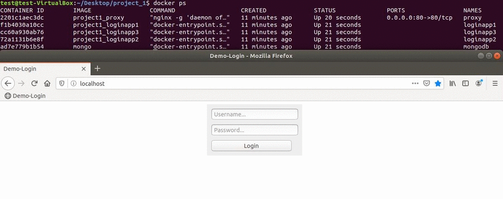

# Scalable Login Example
This example shows a scalable login example based on NodeJs and Docker-Compose.
Attention: The example is not secured - **passwords should never be transmitted unhashed and over an unsecured connection**.

## Requirements
- NodeJs
- Docker + Docker-Compose
## How To Run It (Ubuntu)
1. Create a docker group, add your user and re-login ```sudo groupadd docker && sudo usermod -aG docker $USER && pkill -u $USER```
2. Run with docker-compose ```docker-compose up --build -d``` (Can be shut down with ```docker-compose down```)
3. Check if everything is running ```docker-compose ps```
4. Now we will add a test user

   4.1. Connect to the mongo container ```docker exec -it mongodb bash```
   
   4.2. Login with the user from the .env file ```mongo -u admin -p secred_password```
   
   4.3. Create/Select databse ```use page_users```
   
   4.4. Insert a test user into document users ```db.users.insert({"user":"admin", "password":"secret"})```

5. Now you can open the app by using `localhost`
